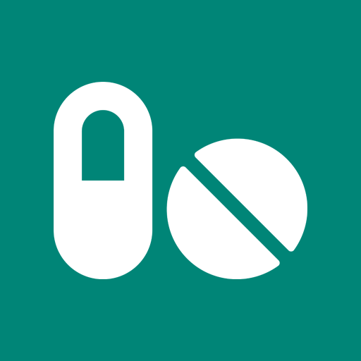
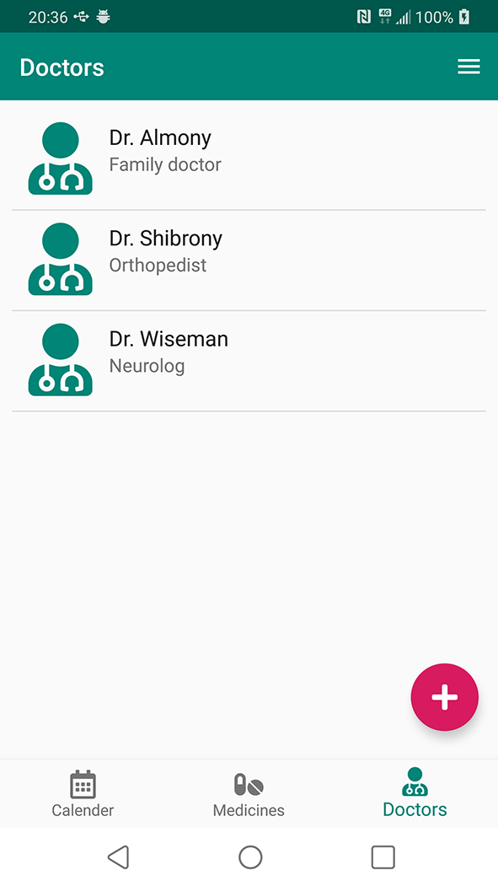
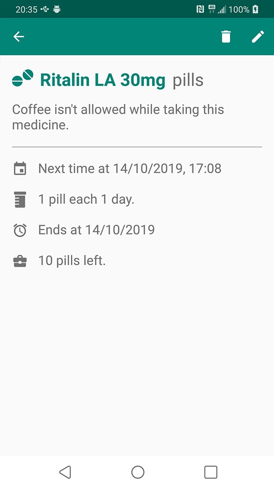

# My Medicine

My Medicine is an "school project" as part of course #67625 at The Hebrew University in Jerusalem.
 
My Medicine is an App for Android (7+) that help tracking medicine times and appointments to the doctor.

**Note:** keep in mind that this App is part of a school project and won't be developed farther then the current last version. 

**Features**
* Keep track of your regular medicines, doctors, when the prescriptions will expire and appointments.
* Instead of writing the name of the medicines, you can use the camera of the phone to scan the barcode (works only with Israeli packages and for a small selection of medicines).
* Notifications to remind you when to take your medicine, the time of appointments and when hte prescriptions will expire.
* Drip counter that sometimes works on some devices.

**Screenshots**

**Technical Notes**
* Uses Firebase to scan barcodes and keep a list of medicines with their barcode for the search feature.
* Uses OpenCV for the drip counter. Which also the reason for the fat APK size.

**License**
* The icon of the application and in some places in the app using Icons of [https://fontawesome.com/license/free](Font Awesome). Icons from font awsome are marked in the vector file.
* The icons that aren't marked with anything, such as Meterial Design Fonts are under [https://www.apache.org/licenses/LICENSE-2.0.html](Apache License 2.0).
* The code under the package 'il.ac.huji.cs.postpc.mymeds.calender_view' are extension for the library [https://github.com/SpongeBobSun/mCalendarView](mCalendarView) which under [https://github.com/SpongeBobSun/mCalendarView/blob/master/LICENSE](Apache 2.0)
* Anything else in the repository is under [https://www.apache.org/licenses/LICENSE-2.0.html](Apache License 2.0).